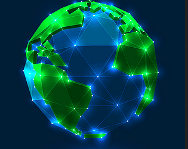
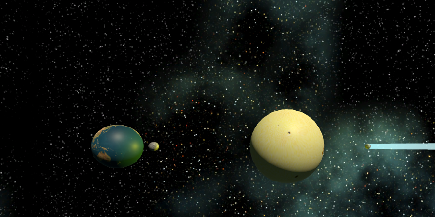

# Solar System Simulator
A Unity‑built 3D virtual simulation that allows players to explore a scaled‑down version of our Solar System. This project provides an educational and interactive way to learn about planets, moons, and comets by freely navigating through space and focusing on different celestial objects.

## Overview 🚀
The Solar System Simulator includes two different exploration systems that players can switch between at any time. Each mode offers a unique way to navigate the solar system and observe celestial bodies. Players can click planets to focus on them, rotate the camera, or move freely using directional controls. The simulation is designed to be calm, informative, and accessible for anyone interested in astronomy.

## Controls 🎮
### Watch Targets Mode
This mode focuses the camera on selected celestial objects.

Left‑Click — Select a target to focus on

Right‑Click — Focus on the Sun

Press ‘C’ quickly — Switch to Arrow Keys mode

### Arrow Keys Mode
This mode allows free movement and rotation of the camera.

Arrow Keys or W / A / S / D — Move the camera

Z / X — Rotate horizontally

Left‑Click — Select an object to set as the next focus target

Press ‘C’ quickly — Switch back to Watch Targets mode

## Web Builds 🌐
Explore the Solar System Simulator directly in your browser:

- [**Itch Games**](https://captain-garneto.itch.io/solar-system-simulator)
- [**Unity Play**](https://play.unity.com/en/games/2999071d-01ce-4b84-931a-4195e657d004/solar-system-simulator)

## Notes 📘
This project was created to practice 3D modeling, orbital layout, camera control, and interactive educational design in Unity. It includes two navigation systems, object selection logic, and smooth transitions between targets. The Solar System Simulator is part of my ongoing development as a Unity programmer and interactive experience designer.

## Author 👤
Daniel Anthony Rozek

[**Portfolio**](https://crispruby.github.io/), 
[**LinkedIn**](https://www.linkedin.com/in/danielrozek/), 
[**GitHub**](https://github.com/crispruby)

## License 📄
This project is open‑source for educational and portfolio use.

## Screenshot Gallery 📸

